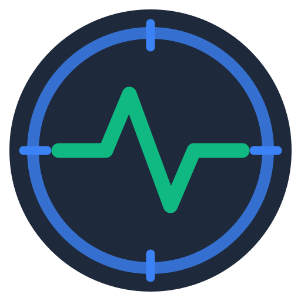

  <!-- Logo (Stelle sicher, dass die Datei unter assets/logos/logo.svg liegt) -->
  

  <h1>Metric Neo</h1>

  

    <strong>Modular Measurement and Maintenance Platform for Shooting Sports.</strong>
  

  <!-- Status & Language -->
  

    
    
  

  <!-- Badges Row 1: Tech Stack & Platform -->

  
  
  
  
  

---

> 🚧 **Project Status: Architecture Phase**
> This repository currently serves as the **architectural blueprint and specification** for Metric Neo.
> The implementation phase (coding) has not yet started.
>
> 🇩🇪 **Note:** While the source code and UI are in English to adhere to international standards, the architectural decision records (ADRs) and domain specifications in the `/docs` folder are currently maintained in **German**. This reflects the primary requirements of the initial stakeholder group (DACH region).

## 🎯 Mission
Metric Neo is a high-assurance, offline-first desktop application designed to capture, analyze, and archive **chronograph data** from RS232 chronographs (specifically LMBR).

It solves the scalability issue faced by ambitious sport shooters and equipment managers: **Managing the lifecycle and performance data of multiple devices in a unified, secure system.**

## ⚡ Key Features
*   **Offline First / Air-Gap Ready:** No internet connection required. Zero telemetry.
*   **Hardware Integration:** Auto-discovery of LMBR Chronographs via RS232/USB.
*   **Inventory Management:** Track usage, maintenance intervals, and configurations for unlimited rifles/bows.
*   **Analytics:** Overlay visual comparisons of shot strings to detect performance degradation.
*   **Cross-Platform:** Single codebase for **Windows** and **Linux**.

## 🏗 Architecture
The project follows a **Modular Monolith** approach using **Hexagonal Architecture** principles to separate the domain logic (kinetic analysis & statistics) from the infrastructure (serial ports, file storage).

*   **Backend:** Go (Wails) for type-safe, high-performance serial communication.
*   **Frontend:** Vue.js + Element Plus for a modern, dark-mode compatible UI.
*   **Data Storage:** Local JSON files (human-readable) with an abstraction layer for future encryption.

**[Explore the Architecture Documentation (German) →](./docs/adr)**

## 📅 Roadmap & Progress

- [x] **Phase 1: Conception**
    - [x] Requirements Analysis (High Assurance / Offline)
    - [x] Technology Selection (Go/Wails/Vue)
    - [x] Domain Modeling
- [x] **Phase 2: Architecture**
    - [x] System Context & Container Diagrams
    - [x] Architecture Decision Records (ADRs) defined
    - [x] Security Strategy (Air-Gap / Linux First)
- [x] **Phase 3: Backend Foundation**
    - [x] Domain Layer (Framework-Agnostic)
        - [x] Core Entities & Value Objects (Shot, Session, Projectile)
        - [x] Ballistic Calculations (Velocity/Energy)
        - [x] Unit Tests for Domain Logic
    - [x] Persistence Layer
        - [x] JSON Repository Implementation
        - [x] Snapshot Pattern (Deep Copy for Audit Trail)
    - [x] Framework Integration
        - [x] Initialize Wails Project Structure
        - [x] Application Service Layer (Domain ↔ UI Bridge)
- [-] **Phase 4: UI & Hardware Integration**
    - [-] Frontend Foundation (Vue.js + Naive-UI)
        - [ ] Session Management UI
        - [ ] Shot Data Visualization
    - [ ] Hardware Integration
        - [ ] RS232 Serial Driver (LMBR Protocol)
        - [ ] Auto-Discovery & Error Handling
    - [ ] First Alpha Release
- [ ] **Phase 5: CI/CD & Automation**
    - [ ] Configure GitHub Actions (Cross-Compile Wails for Win/Linux)
    - [ ] Setup Quality Gates (Go Vet?, biome.js ? Testing?)
    - [ ] Automate Release Pipelines (Draft Releases & Artifact Upload)
- [ ] **Phase 6: Web Presence & Ecosystem**
    - [ ] Setup VitePress for Documentation & Landing Page
    - [ ] Configure GitHub Actions for Automatic SFTP Deployment
    - [ ] Implement Automated Download Page

> **Note on Implementation Strategy:** The backend is developed in a layered approach (Domain → Persistence → Framework) to ensure maximum testability, portability, and adherence to hexagonal architecture principles. This allows the core logic to remain framework-agnostic and simplifies future platform extensions.
## 🚀 Getting Started

### comming soon...

## 🛡️ Security & Privacy

**Metric Neo** is built with a "Linux First" mindset regarding auditability. It relies on explicit user control and avoids any runtime dependencies on external CDNs or cloud services.
📄 License

Distributed under the MIT License. See LICENSE for more information.
