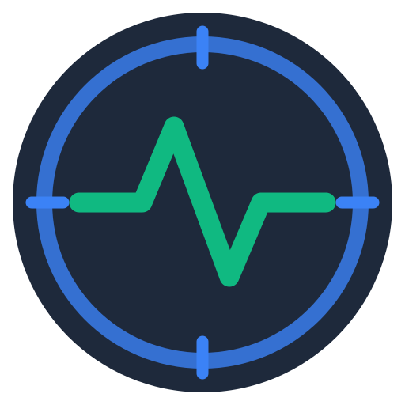

<div align="center">
  

  <h1>Metric Neo</h1>

  <p><strong>Offline-first chronograph data platform for shooting sports.</strong></p>

  <p>
    
    
    
    
    
    
  </p>
</div>

---

> 🇩🇪 **Note:** Source code and UI are in English. ADRs and domain specifications in `/docs` are maintained in German for the primary stakeholder group (DACH region).

## 💡 Why Metric Neo?

No usable software existed for the LMBR RS232 chronograph on Linux. What started as a small utility to capture serial data quickly escalated into a full platform — once you start tracking one rifle's performance, you want to track all of them. Metric Neo is the result of that escalation.

## ⚡ Key Features

- **Offline First / Air-Gap Ready** — No internet required. Zero telemetry.
- **Hardware Integration** — Auto-discovery of LMBR Chronographs via RS232/USB.
- **Inventory Management** — Track rifles, bows, projectiles, and maintenance intervals.
- **Analytics** — Visual comparison of shot strings to detect performance degradation.
- **Cross-Platform** — Windows 10/11 and Linux (Ubuntu 24.04+, Fedora, Arch).

## 📦 Download

Get the latest release from the [GitHub Releases page](../../releases/latest).

| Platform | File |
|---|---|
| Windows 10/11 | `metric-neo_VERSION_windows_amd64.exe` |
| Ubuntu 24.04+ / Debian | `metric-neo_VERSION_ubuntu24_amd64.deb` |
| Fedora | `metric-neo_VERSION_fedora_amd64.rpm` |
| Arch Linux | `metric-neo_VERSION_arch_amd64.pkg.tar.zst` |

## 🚀 Getting Started

**Linux (Ubuntu 24.04+)**
```bash
sudo apt install ./metric-neo_*_ubuntu24_amd64.deb
metric-neo
```

**Linux (Fedora)**
```bash
sudo dnf install metric-neo_*_fedora_amd64.rpm
metric-neo
```

**Linux (Arch)**
```bash
sudo pacman -U metric-neo_*_arch_amd64.pkg.tar.zst
metric-neo
```

**Windows** — Download the `.exe` and run directly. No installer required.

## 🛡️ Security & Privacy

Built with a "Linux First" mindset. No cloud services, no CDN dependencies, no telemetry. Data is stored locally as human-readable JSON files under full user control.

## 📚 Documentation

- [Architecture Decision Records (German)](./docs/adr)
- [Roadmap](./docs/ROADMAP.md)
- [User Manual](./docs/user-manual.md)

## 📄 License

Distributed under the MIT License. See [LICENSE](LICENSE) for details.
