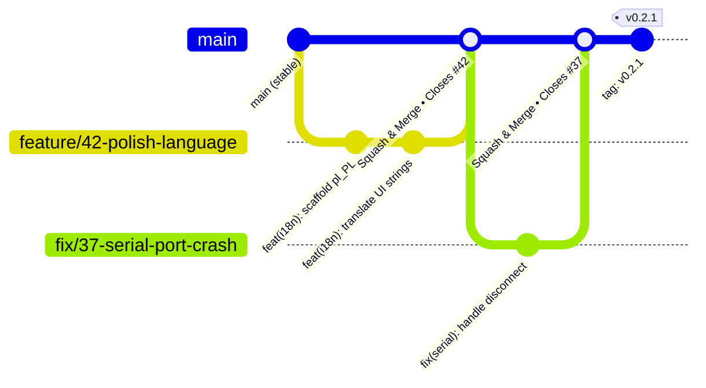

# Git Strategy – Metric Neo

> **Scope:** Solo / small-team project. Lightweight by design — enough structure to present well on GitHub and keep CI/CD reliable, without ceremony overhead.

---

## 0. Repository Structure (Monorepo)

This repository holds three distinct domains in one place:

| Directory | Domain |
|---|---|
| `software/` | Desktop application (Go / Wails / Vue) |
| `website/` | Landing page & documentation site (VitePress) |
| `docs/` | ADRs, specs, internal documentation |
| `assets/` | Logos, screenshots, diagrams |

All domains share one `main` branch. Separation is handled via **branch scopes** and **path-based CI triggers** — no separate repos needed at this scale.

---

## 1. Branch Model

Two permanent branches, short-lived feature branches.

```
main          ← always stable, tagged releases only
  └── feature/42-polish-language        ← app
  └── fix/37-serial-port-crash          ← app
  └── website/55-landing-page-hero      ← website
  └── docs/update-adr-003               ← docs/assets
  └── chore/ci-linux-pipeline           ← infrastructure
```

| Branch prefix | Domain | Purpose |
|---|---|---|
| `feature/<issue#>-<slug>` | App | New app functionality |
| `fix/<issue#>-<slug>` | App | Bug fixes in the app |
| `website/<slug>` | Website | Landing page, VitePress content |
| `docs/<slug>` | Docs | ADRs, specs, strategy docs |
| `chore/<slug>` | Any | CI, tooling, dependencies, assets |

**Rules:**
- `main` is **protected** — no direct pushes.
- Every branch starts from `main` and merges back into `main` via Pull Request.
- Branches are deleted after merge.
- No long-lived `develop` or `release` branches needed at this scale.

**Grouping multiple related issues into one branch:**

| Situation | Branch name |
|---|---|
| Single issue | `feature/42-polish-language` |
| 2–3 related issues | `feature/i18n-multilanguage-support` |
| Many issues under one milestone | Create umbrella issue → `feature/40-i18n-foundation` |

When a branch covers multiple issues, list all of them in the PR description — GitHub will close them all on merge:
```markdown
Closes #42
Closes #43
Closes #44
```

---

## 2. Commit Convention

[Conventional Commits](https://www.conventionalcommits.org/) — minimal subset:

```
<type>(<scope>): <short description>

[optional body]

Closes #<issue>
```

**Types:**

| Type | When |
|---|---|
| `feat` | New feature |
| `fix` | Bug fix |
| `chore` | Build, CI, dependencies, tooling |
| `docs` | Documentation only |
| `refactor` | Code change without functional effect |
| `test` | Adding or fixing tests |

**Examples:**
```
feat(i18n): add Polish (pl_PL) translation
fix(serial): handle port disconnect during active session
chore(ci): add linux build pipeline
docs(adr): add ADR 004 for i18n strategy
feat(website): add hero section to landing page
chore(assets): update logo to SVG format
```

**Recommended scopes by domain:**

| Domain | Scopes |
|---|---|
| App – backend | `serial`, `session`, `projectile`, `config`, `i18n` |
| App – frontend | `ui`, `router`, `views`, `components` |
| Website | `website`, `vitepress`, `landing` |
| Docs & assets | `docs`, `adr`, `assets`, `ci` |

---

## 3. Issue → Branch → PR Flow



```
1. Create Issue (Bug / Feature / Custom)
2. Open branch:  git switch -c feature/42-polish-language
3. Commit with Conventional Commits
4. Push & open Pull Request → target: main
5. PR title mirrors commit convention
6. Squash & Merge into main
7. Delete branch
```

PRs reference their issue with `Closes #<n>` in the description — GitHub will auto-close the issue on merge.

---

## 4. Versioning & Releases

[Semantic Versioning](https://semver.org/): `MAJOR.MINOR.PATCH`

| Segment | Increment when |
|---|---|
| `MAJOR` | Breaking change / major milestone |
| `MINOR` | New feature, backwards-compatible |
| `PATCH` | Bug fix |

**Tagging:**
```bash
git tag -a v0.2.0 -m "release: v0.2.0"
git push origin v0.2.0
```

A pushed `v*` tag triggers the GitHub Actions release pipeline (build artifacts + draft GitHub Release).

**Pre-releases** use suffixes: `v0.2.0-alpha.1`, `v0.2.0-beta.1`

---

## 5. GitHub Actions Triggers

Pipelines use **path filters** so only the relevant domain triggers a run:

| Trigger | Path filter | Pipeline |
|---|---|---|
| PR / push `main` | `software/**` | Go tests, linter |
| PR / push `main` | `website/**` | VitePress build check |
| Push tag `v*` | — | Cross-compile app (Linux + Windows), draft Release, upload AppImage / `.exe` |
| Push `main` | `website/**` | Deploy website via SFTP |

Example path filter in a workflow:
```yaml
on:
  push:
    paths:
      - 'software/**'
```

This prevents a docs-only commit from triggering a full app build.

---

## 6. Pull Request Checklist

```markdown
- [ ] Branch targets `main`
- [ ] PR title follows Conventional Commits
- [ ] `Closes #<issue>` in description
- [ ] Tests pass locally
- [ ] No debug code / commented-out blocks left in
```

---

## 7. What We Deliberately Skip

The following are intentionally **out of scope** for a solo project:

- `develop` / `release` / `hotfix` branches (Gitflow overhead)
- Mandatory code reviews from multiple reviewers
- Changelogs generated from commits (can be added later if needed)
- Branch-per-environment deployments
