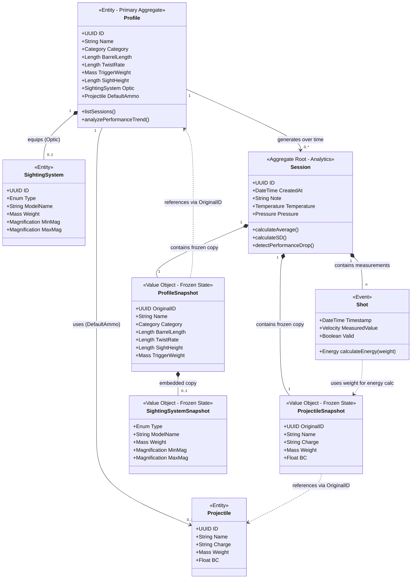

    
# Fachliches Datenmodell (Domain Model)

**Status:** Draft / Phase 1  
**Kontext:** Metric Neo Core Domain

Dieses Dokument definiert die fachliche Architektur, die Entitäten und die physikalischen Regeln des Systems. Es dient als verbindliche Vorgabe für die Implementierung in Go.

## 1. Ubiquitous Language (Begriffsdefinitionen)

*   **Session (Sitzung):** Eine zusammenhängende Reihe von Messungen an einem Tag. Dient als Container für Statistik und Bedingungen.
*   **Shot (Schuss):** Ein einzelnes, unveränderliches Mess-Ereignis mit Zeitstempel und Messwert.
*   **Profile (Geräte-Profil):** Der "digitale Zwilling" des Sportgeräts. Es repräsentiert die Konfiguration aus Waffe, Zielvorrichtung und Einstellungen zum Zeitpunkt der Nutzung.
*   **Sighting System (Zielvorrichtung):** Die montierte Optik oder Visierung (z.B. Zielfernrohr, RedDot).
*   **Projectile (Projektil):** Die verwendete Munition (Diabolo, Pfeil).

## 2. Value Objects (Physikalische Einheiten)

Im System dürfen physikalische Werte niemals als primitive `float`-Zahlen behandelt werden. Sie müssen immer typisiert sein, um Konvertierungsfehler (z.B. Grain vs. Gramm) auszuschließen.

| Typ-Name | Basis-Einheit (Intern) | Verwendung | Beispiel-Werte |
| :--- | :--- | :--- | :--- |
| **Mass** | Gramm (g) | Projektilgewicht, Waffengewicht, Abzugsgewicht | 0.547g, 2500g |
| **Velocity** | Meter/Sekunde (m/s) | Mündungsgeschwindigkeit ($v_0$) | 175.5 m/s |
| **Length** | Millimeter (mm) | Lauflänge, Kaliber, Visierhöhe | 4.5mm, 450mm |
| **Energy** | Joule (J) | Kinetische Energie ($E_0$) | 7.5 J, 16.3 J |
| **Magnification**| Faktor (x) | Vergrößerung der Optik | 4x, 12.5x |
| **Temperature**| Celsius (°C) | Umgebungstemperatur | 21.5 °C |

## 3. Entitäten & Attribute

### 3.1 Session (Das Aggregate Root)
Die Session ist der Container für eine Messreihe. Hier wird der "Kontext" (Waffe & Munition) unveränderlich eingefroren.

| Attribut | Typ | Beschreibung |
| :--- | :--- | :--- |
| **ID** | UUID | Eindeutige Identifikation der Sitzung. |
| **CreatedAt** | DateTime | Startzeitpunkt der Messung. |
| **Note** | String | Freitext für Notizen (z.B. "Training vor Wettkampf"). |
| **Temperature**| Temperature | (Optional) Umgebungstemperatur während der Messung. |
| **Pressure** | Pressure | (Optional) Luftdruck. |
| **ProfileSnapshot** | *Profile* | **Deep Copy:** Eine vollständige Kopie des verwendeten Sportgeräte-Profils (inkl. Visierhöhe, Lauflänge) zum Zeitpunkt der Erstellung. Änderungen an den Stammdaten beeinflussen diese Session nicht. |
| **ProjectileSnapshot**| *Projectile* | **Deep Copy:** Eine vollständige Kopie der verwendeten Munition (Gewicht, BC). Dient als **Single Source of Truth** für die Energieberechnung aller Schüsse in dieser Session. |

### 3.2 Profile (Das Sportgerät)
Beschreibt die Hardware-Konfiguration. Dient der Inventarisierung und Wartung.

| Attribut | Typ | Beschreibung / Relevanz |
| :--- | :--- | :--- |
| **Name** | String | Anzeigename (z.B. "Steyr Challenge E"). |
| **Category** | Enum | `AirRifle`, `AirPistol`, `Bow`, `Firearm`. |
| **BarrelLength** | Length | Lauflänge (relevant für Innenballistik/Beschleunigung). |
| **TwistRate** | Length | Dralllänge (optional, für Stabilisierungs-Check). |
| **TriggerWeight**| Mass | Abzugsgewicht (Wartungs-Indikator für Verschleiß). |
| **SightHeight** | Length | Visierhöhe (Abstand Laufseelenachse <-> Optische Achse). |
| **Optic** | *SightingSystem* | (Optional) Die montierte Zieleinrichtung (siehe 3.3). |
| **DefaultAmmo** | *Projectile* | Referenz auf die Standard-Munition für dieses Profil. |

### 3.3 Sighting System (Zielvorrichtung)
Modelliert die Optik für Inventar und Gewichtskontrolle.

| Attribut | Typ | Beschreibung |
| :--- | :--- | :--- |
| **Type** | Enum | `Scope` (Glas), `RedDot`, `Diopter`, `OpenSights`. |
| **ModelName** | String | Hersteller/Modell (z.B. "Schmidt & Bender PM II"). |
| **Weight** | Mass | Gewicht der Optik (beeinflusst Gesamtbalance). |
| **MinMagnification**| Magnification | Kleinste Vergrößerung (z.B. 3x). Bei Festbrennweite: Min = Max. |
| **MaxMagnification**| Magnification | Größte Vergrößerung (z.B. 12x). |

### 3.4 Projectile (Munition - Stammdaten)
Die Vorlage für die ballistische Berechnung.

| Attribut | Typ | Beschreibung |
| :--- | :--- | :--- |
| **Name** | String | Hersteller/Produktname (z.B. "JSB Exact 4.52"). |
| **Charge** | String | **Kritisch:** Chargen-/Losnummer für Rückverfolgbarkeit und Qualitätskontrolle (z.B. "LOT-2023-11-A"). Munition aus unterschiedlichen Chargen kann abweichende Gewichte haben. |
| **Weight** | Mass | **Kritisch:** Basis für Energieberechnung. |
| **BC** | Float | Ballistischer Koeffizient (Zukunftssicherheit). |

### 3.5 Shot (Das Ereignis)
Ein unveränderlicher Messpunkt. Er bezieht sein Gewicht aus dem `ProjectileSnapshot` der Session.

| Attribut | Typ | Beschreibung |
| :--- | :--- | :--- |
| **Timestamp** | DateTime | Exakter Zeitpunkt des Schusses. |
| **Velocity** | Velocity | Der gemessene Wert (vom Chrono). |
| **Valid** | Boolean | Markierung, ob Messung gültig ist (Fehlmessung/Error). |
| **Energy** | *Calculated* | Wird zur Laufzeit berechnet: $E(Shot.Velocity, Session.ProjectileSnapshot.Weight)$ |

## 4. Beziehungen (Visualisierung)

  

# 5. Berechnungs-Logik & Anzeige-Standards

### 5.1 Kinetische Energie ($E_0$)
Die Energie wird "On-The-Fly" berechnet und nicht persistiert.
$$ E = \frac{1}{2} \cdot m \cdot v^2 $$
*   $m$ in Kilogramm ($kg$)
*   $v$ in Meter pro Sekunde ($m/s$)
*   Ergebnis ist immer in **Joule ($J$)**.

### 5.2 Daten-Integrität (Audit Trail)
* **Problem:** Stammdaten (Profile/Projektile) können sich ändern (z.B. neue Waage, Tippfehler korrigiert).
*   **Lösung:** Historische Sessions dürfen sich dadurch nicht verändern. Beim Erzeugen einer Session werden die aktuellen Werte von Profil und Projektil als **Snapshot** (Deep Copy) in die Session kopiert. Die Berechnung der Schüsse erfolgt ausschließlich auf Basis dieses Snapshots.

### 5.3 Validierung
*   `Velocity` < 0 ist technisch unmöglich -> Error.
*   `Mass` <= 0 ist physikalisch unmöglich -> Error.
*   `Magnification`: Min darf nicht größer als Max sein.

### 5.4 Anzeige-Policy (Display Standards)
Aus Sicherheitsgründen und zur Vermeidung von Interpretationsfehlern erzwingt das System eine strikte Darstellung in SI-Einheiten.

*   **Geschwindigkeit:** Muss **immer** in **Meter pro Sekunde (m/s)** angezeigt werden.
    *   *Hinweis:* Sendet die Hardware (LMBR) Werte in `fps`, werden diese sofort intern in `m/s` konvertiert. Es gibt keine Option, die UI auf `fps` umzustellen.
*   **Energie:** Muss **immer** in **Joule (J)** angezeigt werden.
    *   Die Anzeige von `ft-lbs` ist deaktiviert, um Verwechslungen im DACH-Raum auszuschließen.